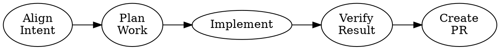
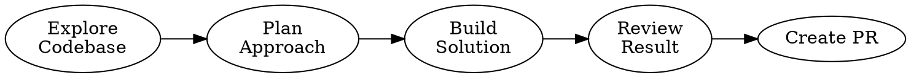
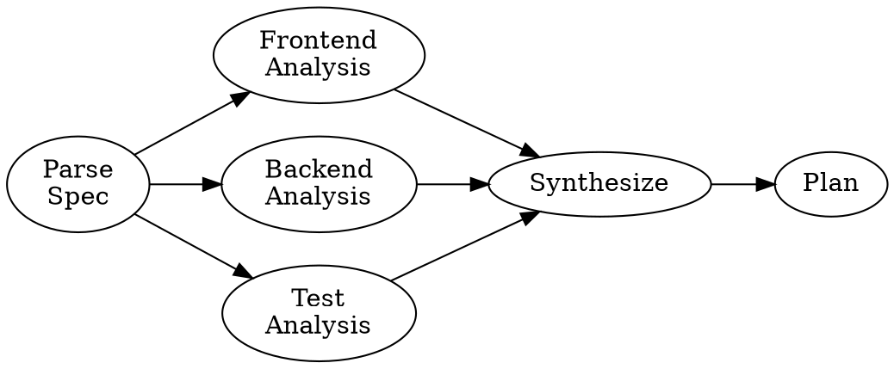
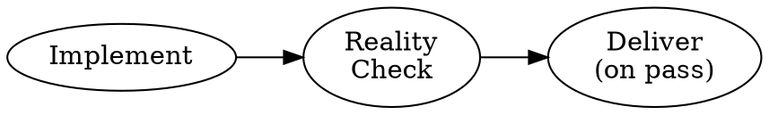

import { Aside, Card } from '@astrojs/starlight/components';
import Mermaid from '../../../../components/Mermaid.astro';

A **pipeline** is a directed acyclic graph written in DOT format. The `dot-graph`
resolver reads the pipeline, executes each node as an isolated Amplifier session,
and passes outputs between nodes as context accumulates through the graph.

Pipelines are the primary way to express multi-phase autonomous workflows in Resolve —
where each node is an agent with its own instructions, tools, and context, all
coordinated by the graph structure.

---

## What a pipeline looks like



The `dot-graph` resolver executes this graph left-to-right:
1. Runs the `Align` session
2. Passes its output into `Plan`
3. Continues through the graph until `Deliver` completes

---

## Node anatomy

Each node in the graph is an Amplifier agent session. The node's DOT attributes
control how it runs.

```dot
NodeName [
  session   = "@mybundle:path/to/prompt"   // required: which bundle/prompt drives this node
  label     = "Human Label\nShown in UI"   // optional: display name in viewport
  timeout   = "1800"                       // optional: seconds before watchdog kills node
  retries   = "2"                          // optional: retry count on failure
  tier      = "blocking"                   // optional: execution tier
];
```

### `session` — the agent bundle (required)

The `session` attribute specifies which Amplifier bundle runs for this node. It uses
the same `@bundle:path` format as `load_skill`.

```dot
Plan [session="@mybundle:prompts/plan"];
```

The bundle's context files and instructions define what the agent does, what tools
it has, and what output it produces.

### `label` — display name

Shown in the `dot-graph` viewport as the node's title. Use `\n` for line breaks.

```dot
Implement [session="@mybundle:impl" label="Implement\nFeature"];
```

### Edges — context flow

Edges define both execution order and context flow. When node A completes, its
output is passed into node B's context before B runs.

```dot
A -> B;           // A must complete before B starts; A's output feeds into B
A -> B -> C;      // chain
A -> {B, C};      // B and C run in parallel (both receive A's output)
{B, C} -> D;      // D waits for both B and C; receives both outputs
```

---

## Execution model

<Mermaid code={`
flowchart TD
    Load["Load DOT graph\ntopological sort"]

    subgraph Parallel ["Parallel nodes (no dependency)"]
        B["Node B"]
        C["Node C"]
    end

    A["Node A\n(runs first)"] 
    D["Node D\n(waits for B + C)"]
    Result(["Pipeline result\n= D's output"])

    Load --> A
    A -->|"A's output\n→ B's context"| B
    A -->|"A's output\n→ C's context"| C
    B -->|"B's output\n→ D's context"| D
    C -->|"C's output\n→ D's context"| D
    D --> Result
`} caption="Execution model — parallel nodes run concurrently, outputs accumulate into downstream context" />

**Parallelism:** Nodes with no dependency on each other run in parallel. The runtime
extracts the maximum parallelism from the graph structure automatically.

**Context accumulation:** Each node receives the outputs of all its upstream nodes
accumulated into its initial context. A node with two parents gets both parents'
outputs as context before it runs.

---

## Common pipeline patterns

### Linear pipeline

The simplest pattern — one phase feeds the next:



### Fan-out / fan-in (parallel investigation)

Explore multiple angles in parallel, then synthesize:



ExploreA, ExploreB, and ExploreC all run in parallel. Synthesize receives all three
outputs before running.

### Convergence loop (iterative refinement)

<Aside type="note" title="Attractor pipeline — advanced pattern">
The dot-graph resolver supports convergence loops where a verify node can send
execution back to implement. This is the "attractor" pattern used in production.
Consult the dot-graph resolver documentation for the specific syntax used by the
production resolvers — it varies by resolver version.
</Aside>

---

## Reality-check integration

Pipelines can trigger reality checks by routing through a verify node that invokes
the SDK capability:



The `@bundle:reality-check-node` session runs the SDK's `start_reality_check()` +
`wait_for_reality_check()` and emits the verdict as an artifact. If the verdict is
`fail`, the node can loop back or escalate.

---

## Pipeline file location

The `dot-graph` resolver looks for pipeline files relative to the instance's working
directory inside the container:

```
/project/.resolve/pipelines/
├── main.dot          # default pipeline
├── quick.dot         # pipeline variant
└── deep.dot          # another variant
```

The pipeline to run is typically selected via the instance's `input.pipeline` field,
which maps to a file in this directory.

---

## Using pipelines with the dot-graph resolver

```bash
# Create an instance targeting the dot-graph resolver with a specific pipeline
curl -X POST "$RESOLVE_URL/api/instances" \
  -H "Authorization: Bearer $TOKEN" \
  -H "Content-Type: application/json" \
  -d '{
    "resolver": "dot-graph",
    "input": {
      "spec": "Add a GET /api/ping endpoint that returns {\"pong\": true}",
      "repo": "myorg/myrepo",
      "pipeline": "standard"
    }
  }'
```

The `dot-graph` resolver schema — use `GET /resolvers/dot-graph/schema` to see the
exact input fields for the registered version.

---

## Tips for effective pipelines

<Card title="Keep nodes focused">
Each node should have one responsibility. A node that explores AND plans AND
implements is impossible to iterate on. Split into three nodes.
</Card>

<Card title="Use fan-out for independent exploration">
If two analyses don't depend on each other, run them in parallel. The runtime
handles parallelism automatically from graph structure.
</Card>

<Card title="Context accumulates — be intentional">
Every upstream node's output becomes context for downstream nodes. If an upstream
node is verbose, downstream nodes get a lot of context. Design node outputs to be
summaries, not raw dumps.
</Card>

<Card title="Reality check at the right gate">
Put a reality-check node after implementation, before delivery. A reality-check
before implementation only tells you the repo is broken before you touched it.
</Card>
